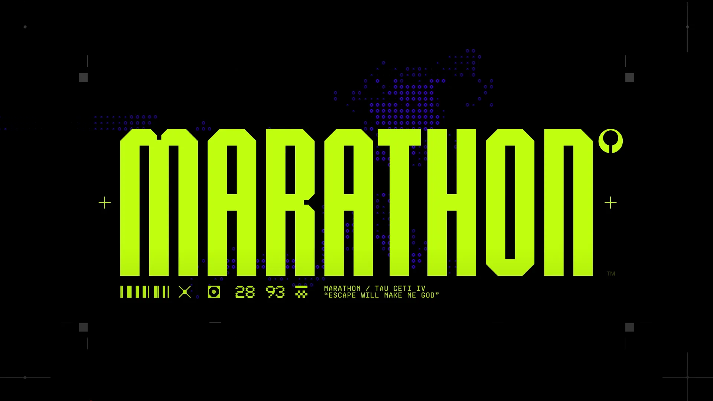

# 失落星船-马拉松风格的：番茄钟（使用AI的编程开发）

## 程序简介

这是一个具有马拉松风格的番茄钟应用，采用了失落星船的设计元素，帮助用户提高工作和学习效率。应用具有简洁明了的界面和丰富的功能，支持自定义工作时间、休息时间和学习轮数，并且能够记忆用户的最后一次设置。

## 程序功能

- **完整的番茄钟功能**：支持工作时间和休息时间的切换
- **自由设定时间**：可自定义工作时间、休息时间和学习轮数
- **轮数指示器**：从右边的方块开始，直观显示剩余轮数和当前轮数
- **状态指示**：显示当前倒计时状态
- **控制按钮**：提供开始、暂停、重置按钮
- **设置面板**：通过左下角的设置按钮打开，可调整各种参数
- **配置记忆**：自动记忆用户的最后一次设置
- **色彩方案**：可通过Config.json文件定义色彩方案

## 界面预览

### 主界面

### 设置按钮

### 装饰元素

## 使用说明

1. **启动应用**：打开网站后，应用会自动加载默认配置或用户的最后一次设置
2. **开始倒计时**：点击「START[>]」按钮开始倒计时
3. **暂停倒计时**：点击「PAUSE[/]」按钮暂停倒计时
4. **重置倒计时**：点击「RESET[^]」按钮重置倒计时
5. **调整设置**：点击左下角的设置按钮打开设置面板，调整工作时间、休息时间和轮数
6. **保存设置**：在设置面板中调整完参数后，点击「SAVE」按钮保存设置

## 配置说明

应用的配置存储在`Config.json`文件中，包含以下内容：

- **颜色配置**：定义应用的基础颜色和高亮颜色
- **设置配置**：定义默认的工作时间、休息时间和轮数

用户的设置会自动保存到浏览器的localStorage中，下次访问时会自动加载。

## 技术栈

- **前端**：HTML5, CSS3, JavaScript
- **字体**：3270NerdFont-Regular.ttf, shortwavegothic-bold.otf
- **图标**：SVG格式
- **存储**：localStorage

## 开发说明

本应用是使用AI辅助开发的，采用了模块化的设计思路，代码结构清晰，易于维护和扩展。

### 核心文件

- **index.html**：应用的主页面
- **styles.css**：应用的样式文件
- **script.js**：应用的逻辑文件
- **Config.json**：应用的配置文件

### 开发环境

- **本地服务器**：Python http.server
- **浏览器**：支持HTML5和JavaScript的现代浏览器

## 致谢

感谢使用本应用！如果您有任何建议或反馈，欢迎联系我们。

---

*失落星船-马拉松风格的番茄钟，让时间管理更高效！*